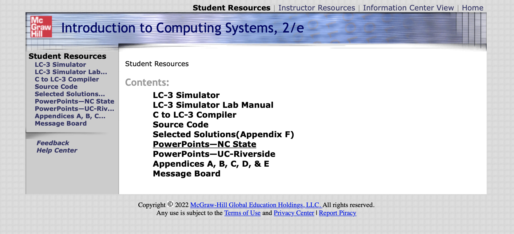
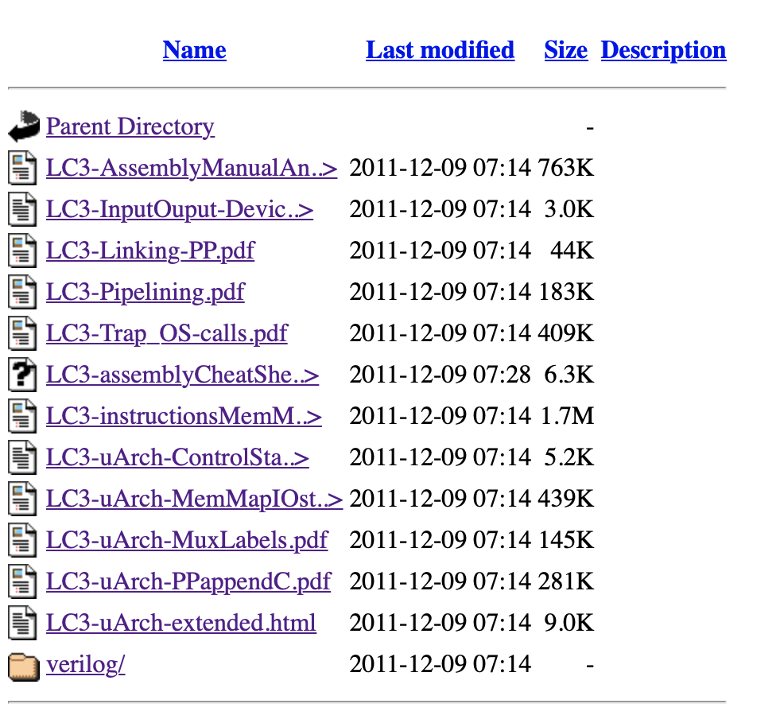

# LC-3 Assembler

This project is an assembler written in C for [Little Computer 3 (LC-3)]((https://en.wikipedia.org/wiki/Little_Computer_3))

Here's the list of resources taken as reference for the implementation

- [Wikipedia](https://en.wikipedia.org/wiki/Little_Computer_3)

- [GUI simulator](https://www.cis.upenn.edu/~milom/cse240-Fall05/handouts/lc3guide.html)

- [simulator (Virtual Machine) implementation](https://justinmeiners.github.io/lc3-vm/)

- [learning resources](https://highered.mheducation.com/sites/0072467509/student_view0/index.html)




- [LC-3 details](https://people.cs.georgetown.edu/~squier/Teaching/HardwareFundamentals/LC3-trunk/docs/)




## Build

To build the project and run the tests, either one of the following options can be used:

- VSCode tasks

- Makefile

VSCode tasks are specially useful to debug the application.


For details about the different compilation flags, see the [GNU docs](https://gcc.gnu.org/onlinedocs/gcc-10.1.0/gcc/Invoking-GCC.html#Invoking-GCC). 

Here's a brief description of some of the flags used in this project.

#### -fno-common

Used to disable [common symbols generation](https://stackoverflow.com/questions/66044467/why-does-global-variable-definition-in-c-header-file-work).

The justification to use this flag is to enforce good practices when defining global variables, namely: define them in exactly one .c file, then declare them as an extern in a header file which then gets included in the required .c files

#### address sanitizer

https://developers.redhat.com/blog/2021/05/05/memory-error-checking-in-c-and-c-comparing-sanitizers-and-valgrind

## Unit tests

Unit tests are executed with the command:

`make unittest`

After running the unit tests, a browser window will open with the test coverage information, that is the final product of using [gcov](https://gcc.gnu.org/onlinedocs/gcc-10.1.0/gcc/Gcov-Intro.html#Gcov-Intro) and [lcov](http://ltp.sourceforge.net/coverage/lcov.php). See next section for more details.

https://docs.gtk.org/glib/testing.html

https://www.manpagez.com/html/glib/glib-2.42.2/glib-Testing.php

### Test coverage

Test coverage is done with [gcov](https://gcc.gnu.org/onlinedocs/gcc-10.1.0/gcc/Gcov-Intro.html#Gcov-Intro), that takes as input two files, [.gcda and .gcno](https://gcc.gnu.org/onlinedocs/gcc-10.1.0/gcc/Gcov-Data-Files.html#Gcov-Data-Files), which are generated thanks to the compilation flags `-fprofile-arcs` and `-ftest-coverage option`, respectively.

The output of gcov is  *.gcov files containing the profiling information in a human-readable format. That information can be better displayed with a graphical tool like [lcov](http://ltp.sourceforge.net/coverage/lcov.php)

__Note__: in MacOS, lcov can be installed with `brew install lcov`


## Acceptance tests

Acceptance tests are run using a test oracle to compare the oracle predictions to the results of the application.

The oracle is the assembler utility included in:

```
wget https://acg.cis.upenn.edu/milom/cse240-Fall05/handouts/code/LC3sim.jar                                                            
```

`LC3sim.jar` is also a runtime environment to execute the binary code generated by
the assembler.

To execute `LC3sim.jar`, run

```
java -jar LC3sim.jar &
```

## Application

`make myfile CPPFLAGS=-DFAB_MAIN`


## Support tools

The folder `tools` contains some utilities to aid with the development of this assembler:

* `lc3objdump` is a version of [objdump](https://en.wikipedia.org/wiki/Objdump) to print the binary content of an object file generated by the LC3 assembler; Makefile shows how to run it

__STDC_VERSION__
macro whose value indicates which standard is supported by the compiler

## Shared objects

cmocka for unit testing
brew install cmocka

another library for unit testing
glib2.0
sudo apt-get update
sudo apt-get install libglib2.0-dev


## Implementation notes

Each line of the assembly file corresponding to an instruction/directive is:

- converted into a 16-bit integer (using big-endian format)
- stored in a memory cell (each memory cell is 16-bit long)

The number of memory cells is 2**16, therefore a memory address fits in a memory cell
(making it possible to have pointers)

The memory address in which an instruction is stored corresponds to the position of said instruction inside
the assembly file: the position (instruction number) is the offset to be added to the value defined by the .ORIG directive.

For instance, given `.ORIG n`, the first instruction in the file is stored on memory address `n`, the second one on `n+1` and so on.

Instructions and values (allocated by directives) shared the same address space and therefore can be intermingled in memory. This requires extra care to avoid ending up with the PC pointing to memory address containing a random value instead of an actual instruction.